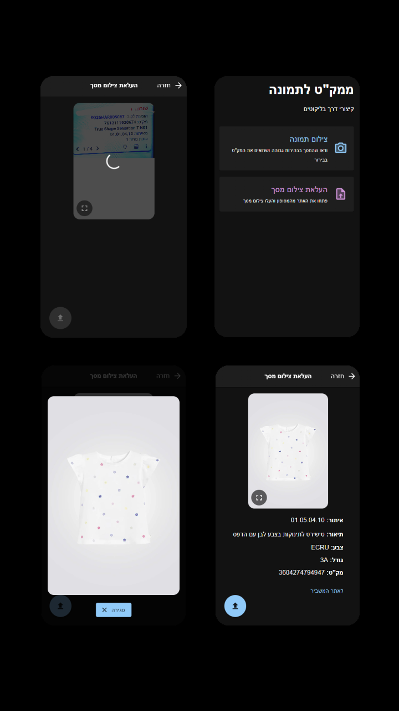

# Product to Image - Warehouse Productivity Tool

A full-stack web application that streamlines the real-time product location process in a fast-paced warehouse environment.

**Client:** Pick & Pack Ltd (ICL Group)  
**Tech Stack:** React, Node.js, Google Cloud Functions, Tesseract.js  
**Scale:** Actively used daily on the warehouse floor, sustaining 25,000+ scans over 6 months.

## The Challenge

Pick & Pack manages the logistics and fulfillment for Mashbir Online. A major operational bottleneck was locating specific items to pack orders. While workers knew the general aisle or bin location, they lacked visual references for the actual clothing items. To optimize space, different items were stored in the same bins. The only verification method was manually, and blindly, comparing the UPC/EAN (GTIN) barcode on the physical item to the one on their Mobile Computer order screen. This was a frustrating, highly manual process for workers expected to pack 200–500 items a day while navigating ladders and crouching in aisles.

## The Solution

An intuitive, OCR-based web application optimized for the operators' Mobile Computers, allowing them to scan orders and instantly retrieve product images and data.

## Development Phases

### Phase 1: MVP & Rapid Prototyping

The initial proof-of-concept was a serverless static page developed in under an hour. Users utilized their personal phone cameras to capture the Mobile Computer's order screen. Because the screens lacked standard barcodes, the app leveraged **Tesseract.js** and custom RegEx to extract the raw UPC/EAN (GTIN) text. It then dynamically redirected users to the public Mashbir search engine. Google Analytics was integrated to track `scan_success` and `scan_fail` events. While it proved the concept and generated positive feedback, relying on personal phones and third-party site redirection caused user friction.

### Phase 2: Production Release & Official Integration

Based on direct user feedback, the product was refined into a highly reliable, mobile-optimized web application that operators save directly to their warehouse Mobile Computers for seamless access. During development, I discovered an undocumented API endpoint used by the Mashbir search engine. I responsibly disclosed the unsecured API to the Mashbir Online website owner and subsequently secured official written consent to integrate it into this tool.

To ensure security and prevent potential request overloads, the API was routed through a rate-limited **Google Cloud Function**. The final result is a reliable, real-time productivity tool that directly interfaces with Mashbir's backend.

### Phase 3: Maintenance and Optimizations

Reduced scanning latency by **52%** and improved scanning accuracy to **99%**. The following optimizations and fixes were implemented:

1. **API Integration Fixes**
   - Enabled fetching for items that are out of stock from the Mashbir API.

2. **Client-Side Image Processing (OCR Bottleneck Resolution)**
   - **Image Cropping:** Cropped the image to contain only the relevant data area before scanning to reduce the processing payload.
   - **Fallback Mechanism:** Added a full-screen scan fallback for instances where the cropped scan fails.
   - **Canvas Optimization:** Switched from Blob scanning to Canvas processing, which notably improved performance.

3. **Network & Connection Optimizations**
   - **TCP Connection Pool:** Using an HTTP Agent and Axios, I created a TCP connection pool with open sockets to Mashbir's Search API to reduce latency caused by a TCP handshake upon every request.
   - **Pre-warming Connections:** Sent empty HEAD requests before the text extraction completes to ensure connection re-use of external APIs in the backend and significantly shorten cold start times. This also opened new sockets if there are none in the connection pool.
   - **Regional Deployment:** Moved the Cloud Function to Israel (`me-west1`), eliminating a transatlantic network round-trip.
  
4. **Serverless Cold Start Elimination**
   - Min Instance Scheduling: Utilized Google Cloud Scheduler to dynamically adjust the Cloud Function's minimum instances. By scaling the minimum instance count to 1 at the beginning of the warehouse shift and back to 0 at the end, I eliminated cold starts entirely during operational hours while preventing unnecessary idle compute costs overnight.

5. **Aggressive Batch "Caching" via Firestore**
   - **The Hypothesis:** Even though each scan has a different barcode, many different barcodes map to the same parent product. Caching all product variants simultaneously during a single scan would save future external API calls.
   - **The Validation:** I analyzed scan data over a span of a few days to test this hypothesis. The measurement yielded the following results:

   **Data Analysis Summary:**
   - Total logs: 1,265
   - Logs with shared variants: 587
   - Average number of shared logs per log (all valid): 0.83
   - Average number of shared logs per log (among sharers): 1.80

   **Distribution of Shared Logs:**
   - Logs sharing with exactly 0 other logs: 677
   - Logs sharing with exactly 1 other logs: 342
   - Logs sharing with exactly 2 other logs: 132
   - Logs sharing with exactly 3 other logs: 60
   - Logs sharing with exactly 4 other logs: 20
   - Logs sharing with exactly 5 other logs: 18
   - Logs sharing with exactly 6 other logs: 7
   - Logs sharing with exactly 7 other logs: 8
   - Logs sharing with exactly 8 or more other logs: 0

   **Barcodes with Different Variant Arrays:**
   - No discrepancies found. All barcodes have consistent variant arrays.

   - **The Implementation:** The initial data suggested a potential 46% cache hit rate. Because the Mashbir search server is located in the US and suffers from high average latency over TCP connections, I determined that building a persistent caching layer via Firestore would save significant processing time. I connected Firestore and implemented the following logic:
      - On cache miss, fetch the product along with all its variants from Mashbir's Search API using the HTTP agent.
      - Format the data and publish it to Google Pub/Sub to write documents in the background. 
      - Return the response to the user as quickly as possible.
   - **Results:** After messuring for 3 weeks, I got the following data:
      - cache_hits: 1002
      - cache_misses: 1463
      - hit_to_miss_ratio: 0.685
      - hit_percentages: 0.406
      - avg_cache_get_ms: 39.559
      - avg_pubsub_publish_ms: 48.487
      - avg_fetching_time_mashbir_ms: 279.806
      - avg_req_process_time_ms: 221.306
      - connection_reuse_to_total_ratio: 0.913
   - **Conclusion**: The production results show a ~40.6% hit rate, allowing those requests to be handled in under ~50ms (avg_cache_get_ms). Factoring in the background publishing overhead during a cache miss, the overall average request processing time is shorter than directly fetching from Mashbir. Ultimately, the TCP connection pooling and the Min Instance Scheduling provided the most significant optimization for average latency, and caching made it so that fetching products from my cloud function is faster than fetching directly from Mashbir's API. 
   - **Next Steps:** I will continue to measure the cache hit/miss rate over the next few weeks. I expect avg_req_process_time_ms to drop even further as the database populates with more products.

## Demo

Please contact me directly to request access to a working demo of the application.
ishaicarmeli@gmail.com